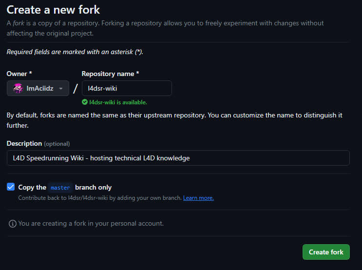
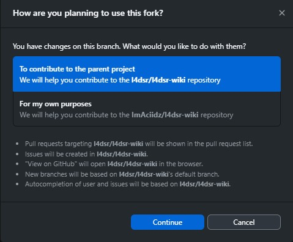
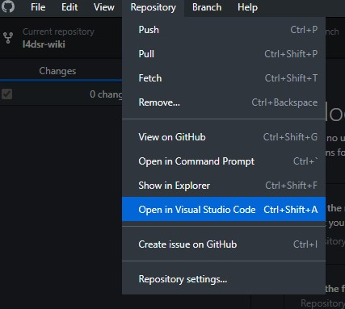
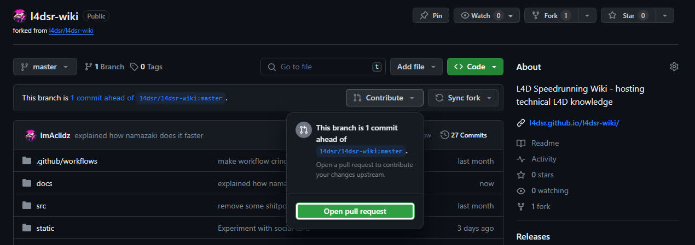
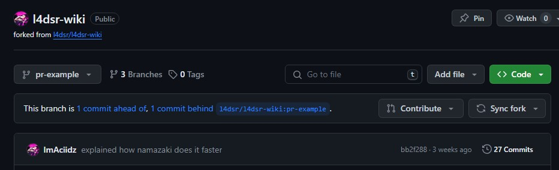
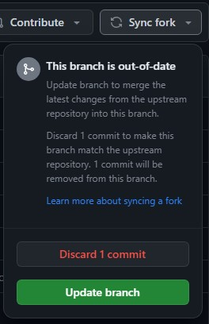

# ⌨ The hackerman way

:::caution WIP
Guide is mostly complete, but some minute details are missing at the moment.

There is also a lack of consistency in the usage of inline code blocks vs emboldening text that should probably be resolved At Some Point™
:::

Unless you suffer from programmer brain, contributing to the wiki is unfortunately not a very straight forward process. It requires the use of a handful of tools that are made by programmers, for programmers, which makes them a bit of a pain to setup and use for the average person.

:::info
The goal of this contribution guide is to walk you through the entire process step-by-step, while attempting to explain the tools you will be using so you (hopefully) don't feel like you're blindly installing random programs.
:::

## First steps on GitHub

Since the source code for this wiki is hosted on GitHub, that's where our first few steps begin.

## The tools you'll need (and why)

- [GitHub Desktop](https://desktop.github.com)
- [NodeJS](https://nodejs.org/en)
- [Visual Studio Code](https://code.visualstudio.com/)

...ok but like why?

### Git

**Git** is the tool that enables us to collaborate on this wiki. It lets us save a version history of all our files and sync the changes we make locally to the central repository that's hosted on GitHub. We'll talk more about *how* to use Git and how it works in the chapter about making your changes. For now, let's just focus on getting it set up.

What makes Git a little confusing is that there are a lot of different versions out there. [The OG Git](https://git-scm.com) is actually just a command-line tool, meaning you open up a terminal, type in `git` followed by some commands that tell the program what you want it to do.

And while that's great for a lot of programmers, it's terribly unusable for literally everyone else. That's why third parties have brought it upon themselves to create their own Git clients that actually look like apps that humans might use. For this guide we'll be using [GitHub Desktop](https://desktop.github.com) because it integrates quite smoothly with GitHub itself, which is where we host the source code for this wiki.

:::note
You can of course use other Git clients like [Sublime Merge](https://www.sublimemerge.com/) or [GitKraken](https://www.gitkraken.com/), or even the original [Git](https://git-scm.com) if you hate yourself. They will all do what you need them to do, because we will only be using the *very* fundamental features of Git.
:::

Upon opening GitHub Desktop for the first time, you might get prompted to connect your GitHub Account with the app. If you not, you can do so manually via File > Options, then you should see the 'Sign In' button right at the top of the Accounts tab.

 

What we want to do now is `fork` the main repository and then `clone` it onto our local drive.

:::note
You don't actually have to fork the repository first because GitHub Desktop has a button for forking the repo if you try to commit changes to a repository you don't have write access to, but as I (aciidz) have write access to the wiki repository, I can't properly take screenshots of the process in GitHub Desktop without creating another GitHub account, which I'm not about to do for this tutorial. If you're reading this guide and want to fork it from GitHub Desktop, I have full faith that you can figure it out on your own.
:::

So, how to fork the repository: head over to the wiki's repository on GitHub and click the Fork button in the top right as pictured below.

This will take you to a new screen where you can change the name and description if you like. 

You'll probably want to leave the checkbox labeled 'Copy the `master` branch only' ticked, but you are doing no harm either way. Unticking it just means that you're also copying over any other branches we may have made that you probably don't need.

Once you've hit the green button, the fork will be created, and you can now `clone` it.

At the top left of GitHub Desktop, click `File` and then select 'Clone a repository'.

Then, click on the `URL` tab and put `INSERTYOURUSERNAMEHERE/l4dsr-wiki` in the `URL` field, and then click the blue `Clone` button. **In case it is not obvious, replace `INSERTYOURUSERNAMEHERE` with the username of your GitHub account.**

GitHub Desktop will now ask you whether you are planning to use the fork to contribute back to the original project, or for your own purposes. You will want to select `To contribute to the parent project`.

With this done, you can now move on to installing NodeJS.

### NodeJS

**Node** is . . .

:::caution TODO
explain what node is
:::

The minimum version of NodeJS required to work on this project is 18.0, but I'm currently using 21.x at the time of writing (December 19th 2023).

:::tip
When installing, you don't need to check the box that says something relating to Visual Studio build tools and Chocolatey. (I am too lazy to go find out what it says lol sorry)
:::

After you've installed, open the repo in GitHub Desktop, and click the "Open in Command Prompt" button. You can also navigate to the folder in file explorer, click into the address bar to where you can type, write `cmd`, and hit enter.

Once you have the command prompt open in the repo folder, write `npm install --force`. It will give you some warnings about vulnerabilties - ignore it, this is caused by `mdx-embed` requiring outdated deps, hopefully at some point it will get updated (at which point using `--force` will no longer be necessary).

Once that finishes, you can write `npm start` and hit enter. The site will now compile and a web server will start (& it will open the site in your web browser). Now, any time you save any changes to a file, the site will automatically reload with your changes.

If you want to stop the web server, simply hit ctrl+c and press enter. When you want to start working again, you can simply run `npm start` again.

### Visual Studio Code (or your preferred text editor with markdown syntax highlighting)

**Visual Studio Code** (henceforth referred to as VSCode) is a multi-platform text editor/IDE from Microsoft that has native support for many programming languages, and through the extension marketplace, it has support for just about anything you could ever want.

It also has lots of useful features, including Git integration, which means you can very easily visualize what changes you've made since the last commit in real time. You can also do pretty much everything you'd need to do with Git entirely within VSCode itself.

VSCode also has native integration with Node, so, for example, any mistakes you make that might cause the site to fail to compile will appear inline in the editor (though my experience with this has been buggy at best, e.g. I make a mistake, fix it, but VSCode fails to recognize the problem was fixed).

As I have no motivation to completely reinstall VSCode for the purpose of writing this guide, I will assume you can work through installing it yourself without my assistance.

:::caution
After installing VSCode, you do have one (minor) problem to solve, which is that VSCode doesn't natively support syntax highlighting for MDX files. You have two options for dealing with this:
:::

1. Install the MDX extension
    1. Click the 5th icon on the left ("Extensions")
    2. Search for `unifiedjs.vscode-mdx` and install it (it should be(?) the most popular extension for MDX).
2. Alternatively, tell VSCode to just use normal Markdown syntax highlighting for all MDX files
    1. Open a MDX file
    2. Click `Plain Text` in the bottom right
    3. Click `Configure File Association for '.mdx'...`
    4. Type in Markdown and select it

Being honest, I don't know how much tangible benefit there is to installing the extension over just defaulting mdx to use markdown syntax highlighting, so it's whatever lol

#### Opening the repo in VSCode

The easiest way to open the repo in VSCode is by clicking the `Repository` button at the top of GitHub Desktop, and clicking `Open in Visual Studio Code`.

:::tip
If the option to open it in VSCode is not present, you will have to tell GitHub Desktop to use VSCode by going to `File` > `Options` > `Integrations` > `External Editor` (set to Visual Studio Code)
:::

Alternatively, open VSCode, click the `File` button in the top left, click `Open Folder`, navigate to the location of the repo on your computer, and select that folder.

## Making changes

Insert your finest shitposts, save the file, bruh momentum

:::caution todo
maybe talk about working in branches here, and perhaps there is other things worth covering here, TBD
:::

## Committing changes

Once you have some changes you want to commit, you'll see them in GitHub Desktop. For example:

:::caution
Anything that is checked on the left will be included in the commit. Any files you don't want to include in a commit shouldn't be checked. Additionally, if you only want to commit some of the changes you've made in a given file, see the next heading.
:::

From here, you can type in a commit title and a description. In the title, try to explain what you did in 50 characters or less (if you go over, it's not the end of the world). If you want to be nice to people using Git in a terminal, don't let lines in your description exceed 72 characters, but again, this is also ultimately not that important. Focus on writing useful information instead.

Once you click the commit button, the commit will then appear in the `History` tab.

### Splitting multiple changes from a single file across multiple commits

Sometimes you might make multiple unrelated changes in a single file that you don't want to lump together into one commit.

For example, in the image below, I only want to include the line about Namazaki in the current commit:

So, to achieve this, you simply click the blue area next to the line you want to deselect.

After that, the area next to the line will be green, which means it is deselected and won't be included in the next commit you make. 

### Undoing commits

Sometimes you might make a shitty commit that you don't like or made a mistake in. If you haven't pushed your changes to GitHub, it's very easy to undo them. Simply open the `History` tab, right click on the latest commit, and click `undo`, which will return the changes to the staging area, where you are then free to do as you wish.

If you've already pushed the commits to GitHub, it gets a little more complicated. For now, if this happens, feel free to DM me (aciidz) and I can walk you through it.

:::caution todo
explain this rather than directing people to my DMs lol
:::

## Pushing commits

Once you're happy with your commit(s), you'll need to `push` them to GitHub in order to be able to open a pull request (or let anyone else see the commits in the first place). Up to this point, everything you've done is local to your computer. In essence, when you push a commit, you are syncing the state of the repo on your computer to GitHub.

To push a commit, simply press this button at the top of GitHub Desktop.

## Opening a pull request

Home stretch! This is the final step in the process. The pull request is now the formal step where you make a **request** to the maintainer of the main repository to **pull** the changes you've made on your fork onto the main repository.

To open a pull request, go to the main page of your repository (`github.com/<yourname>/l4dsr-wiki`) and check to see if this bar shows up that reads "This branch is `xyz` commit(s) ahead of l4dsr:master". If you don't see this, that means that you haven't made a commit to your own repository yet.

Click on the dropdown labeled "Contribute" and then on "Open pull request".

This will take you to the final page, where you can edit the title of the pull request or add extra comments if you'd like. Then all that's left is to click the big green button labeled "Create pull request".

The main repository will do some automatic checks to see if the site will compile properly. If any checks fail, that's usually a skill issue on my end, so you don't need to worry that you actually broke something.

Congrats, you made it to the end 💀

**If there's anything unclear, confusing, etc. please feel free to message me (aciidz) on Discord with suggestions.**

## Syncing your repo once changes are merged

So, once your pull request is merged, your repo will fall out of sync with the main repo.

For example, it'll say something like this:

There are a variety of ways to resolve this, but it's simplest to do this through GitHub.

First, click the dropdown. You now have two choices. In most cases, assuming everything you have on the branch has been merged into the main repo, it is preferred (and safe) to click `Discard x commit(s)`. If you have work you want to preserve, you should click `Update branch` instead.

The reason that `Discard x commit(s)` is preferred is that it avoids creating ugly merge commits that ultimately serve no logical purpose for a fork. 

The alternative to a merge commit is to `rebase` your changes on top of the actual repo, but I'm not really familiar with how to do this in GitHub Desktop (I'm used to doing this in commandline Git). 

:::caution todo
I'll try to write a tutorial for this later.
:::

In general, I would suggest making a new branch whenever you want to make some new changes. After a PR is merged, you can delete the branch the commits originated from and forget about needing to resolve merge conflicts and such on your own.