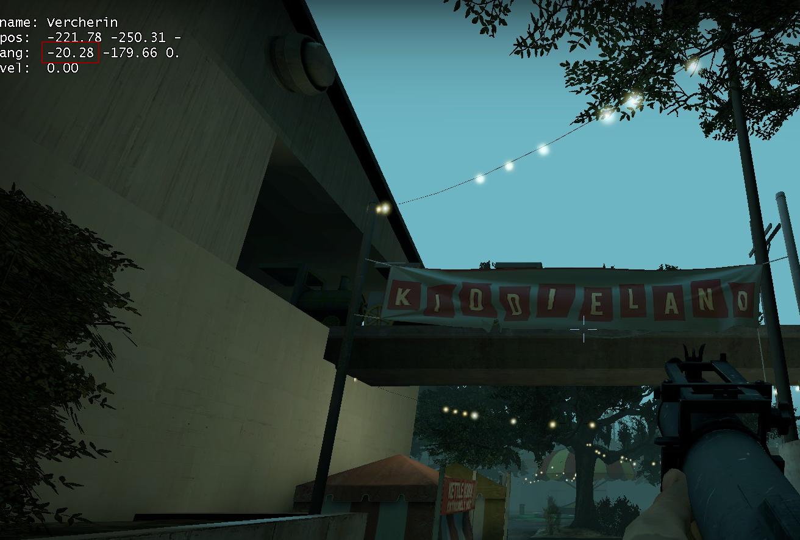

# Boosts

import {YouTube} from 'mdx-embed';

## What is boosting?
Boosting consist at gaining speed using multiple tools which transfered their speed to yours :
  - Common infected
  - Tanks
  - Grenade Launcher 
  - Throwables

## Why should i learn boosting ?

Boosting is used for some tricks and can be a backup for some situations 

:::tip [Coop]
  In coop, boosting is one of the few techniques you need to master with Idle warp. Watch the runners to learn the good positions
:::

## Common boost 
* Common boost consist of using the infected to jump on platforms ( park alarm skip) or higher platform while they jump
* It consist to jump on the common head to bounce on it
* if the common is climbing, his climbing speed will add to you 
:::caution
  Common boost can easily fail since it requires to hit jump the moment you touch the common hitbox
:::

Here is a an exemple of common boost on fairgrounds 

## Tank boost 

Using the tank punch to be able to reach highgrounds. Can be tricky in certains places 

Here is a an exemple of tankboost on fairgrounds 

## Grenade Launcher boost 

Grenade Launcher boost (GL boost) consist of using the Grenade Launcher projectile.

The player getting boosted must jump close and in front of the booster. the booster must be crouched and shoot the moment the boosted is at the higher point of his jump

**This required to be at least 2 players** 

:::info
  The command `sst_autojump 1` can help you see the angle you are aiming 

  The angle is represent by the 1st number after the ang : 
:::

:::caution
The closer the angle to 10° is, the further you will boost
The closer the angle to 90° is, the higher you will boost 
:::

:::info Video Tutorial at 9:02
<YouTube youTubeId="HHfP0vsGoW8"/>
:::

## Throwables boost 

throwables can be used the same way as the GL boost but their launch speed will be reduced

:::info
Throwables boost is often a backup boost from the GL if you don't have one 
:::

## Suggested practices/binds/methods
* Take the ping difference in mind, the boost will be influenced by it
* De-sync can be the biggest issue for coop boosting, be careful with it
* Watch the route taken by top runners, they will show you the optimal boost.
* Watch TheMaster tutorial if you have more questions otherwise ask on the discord.

